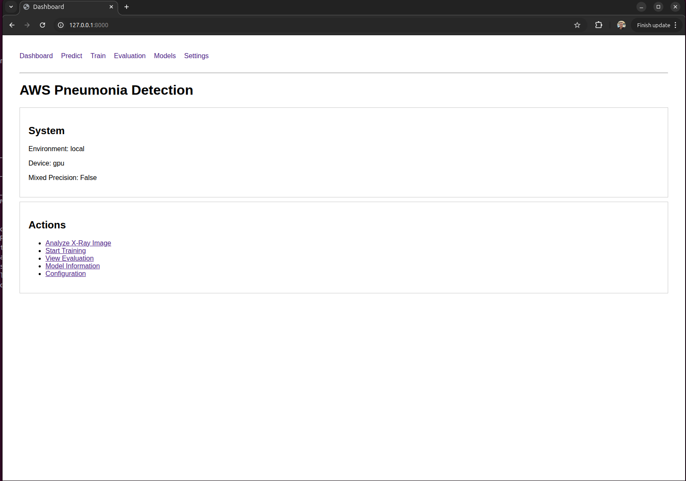
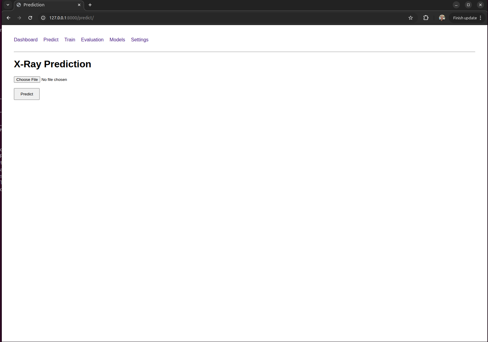
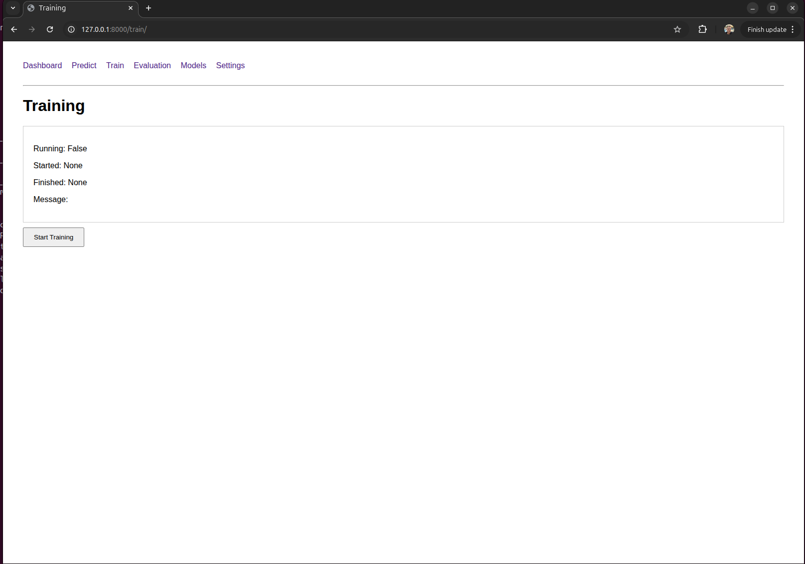
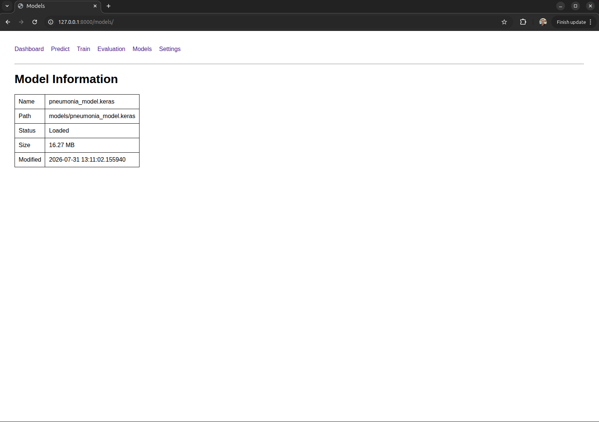
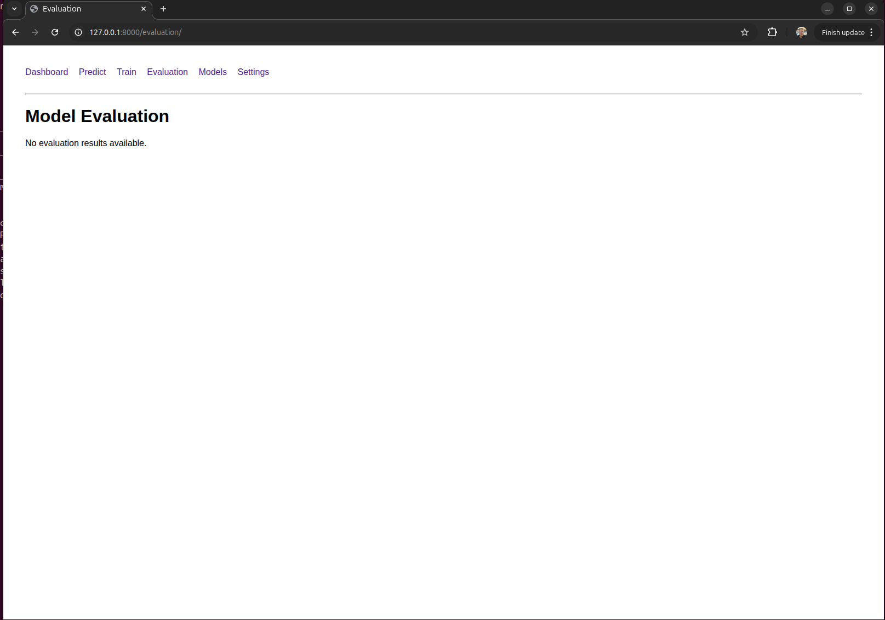

# AWS Pneumonia Detection System

Deep Learning application for detecting pneumonia from chest X-Ray images using **TensorFlow, EfficientNetB0, FastAPI and AWS infrastructure**.

This project demonstrates an end-to-end machine learning workflow:

* Dataset preparation
* Image preprocessing
* Deep learning model training
* Model evaluation
* Local GPU acceleration
* Configuration-driven architecture
* FastAPI web application
* Model inference
* AWS S3 model storage
* Optional AWS GPU training

---

# Project Overview

## Problem

Pneumonia detection from chest X-Ray images is a binary image classification problem.

The model predicts:

```
NORMAL
```

or

```
PNEUMONIA
```

based on an input chest X-Ray image.

---

# System Architecture


Workflow:

```
Chest X-Ray Dataset

        |
        v

Data Preprocessing

        |
        v

TensorFlow Training

        |
        v

EfficientNetB0 Transfer Learning

        |
        v

Model Evaluation

        |
        v

pneumonia_model.keras

        |
        v

FastAPI Application

        |
        +----------------+
        |                |
        v                v

Prediction        Training Dashboard

        |
        v

AWS S3 Storage
```

---

# Project Structure

```
aws-pneumonia-detection/

├── api/
│   ├── main.py
│   ├── dependencies.py
│   ├── routes/
│   │   ├── predict.py
│   │   ├── train.py
│   │   ├── models.py
│   │   ├── evaluation.py
│   │   └── settings.py
│   └── templates/

├── config/
│   ├── config_local.json
│   ├── config_gpu.json
│   └── config_aws.json

├── data/
│   └── raw/
│       └── chest_xray/

├── inference/
│   └── predict.py

├── training/
│   ├── start_training.py
│   ├── evaluate.py
│   └── upload_model.py

├── models/
│   └── pneumonia_model.keras

├── utils/
│   └── config_loader.py

├── screenshots/

├── requirements.txt

└── README.md
```

---

# Configuration Driven Architecture

The application does not hardcode paths or settings.

Configuration is injected through environment variables.

The same codebase can run in different environments:

* Local development
* Local GPU training
* AWS EC2 training
* Production deployment

Architecture:

```
Environment Variable

        |

        v

CONFIG_PATH

        |

        v

config_loader.py

        |

        v

config.json

        |

        v

FastAPI / Training / Inference
```

---

# Configuration Example

Example:

```
config/config_local.json
```

```json
{
    "environment": "local",

    "dataset": {
        "path": "data/raw/chest_xray",
        "train": "train",
        "validation": "val",
        "test": "test"
    },

    "model": {
        "path": "models/pneumonia_model.keras",
        "image_size": [
            224,
            224
        ]
    },

    "training": {
        "epochs": 10,
        "batch_size": 2,
        "learning_rate": 0.0001,
        "transfer_learning": true
    },

    "hardware": {
        "device": "gpu",
        "mixed_precision": false
    },

    "aws": {
        "enabled": false,
        "region": "eu-central-1"
    },

    "inference": {
        "confidence_threshold": 0.5
    }
}
```

---

# Dataset

Dataset:

**Kaggle Chest X-Ray Pneumonia Dataset**

Structure:

```
data/

└── raw/

    └── chest_xray/

        ├── train/

        │   ├── NORMAL

        │   └── PNEUMONIA


        ├── val/

        └── test/
```

---

# Machine Learning Pipeline

## Preprocessing

The preprocessing pipeline:

* Loads X-Ray images
* Resizes images
* Normalizes pixel values
* Creates TensorFlow datasets

---

# Model Training

The model uses:

* TensorFlow
* Keras
* EfficientNetB0
* Transfer Learning
* Binary Classification

Training configuration:

```
Image Size:

224 x 224


Epochs:

10


Optimizer:

Adam


Learning Rate:

0.0001
```

Output:

```
models/

└── pneumonia_model.keras
```

---

# Model Evaluation

Medical classification requires focusing on more than accuracy.

Important metrics:

## Accuracy

Overall correctness of predictions.

## Precision

How many positive predictions were correct.

## Recall

How many pneumonia cases were detected.

High recall is important because missing pneumonia cases should be minimized.

## F1 Score

Balance between precision and recall.

---

# FastAPI Web Application

The project provides a browser-based interface.

## Dashboard

Route:

```
/
```

Features:

* System overview
* GPU information
* Navigation



---

# Prediction Interface

Route:

```
/predict
```

Users can upload an X-Ray image and receive a prediction.

Features:

* Image upload
* Model inference
* Confidence score



Example:

```
Input:

Chest X-Ray


        |

        v


EfficientNetB0


        |

        v


Prediction:

PNEUMONIA


Confidence:

95.4%
```

---

# Training Interface

Route:

```
/train
```

Training can be started directly from the browser.

Features:

* Start training
* Background execution
* Training status
* Logs

Training uses:

```
FastAPI BackgroundTasks
```



---

# Model Management

Route:

```
/models
```

Displays:

* Current model
* Model path
* File size
* Last modification date
* Model availability



---

# Evaluation Dashboard

Route:

```
/evaluation
```

Displays:

* Accuracy
* Precision
* Recall
* F1 Score
* Evaluation results



---

# Settings

Route:

```
/settings
```

Shows:

* Active environment
* Loaded configuration
* Hardware settings
* AWS settings

---

# AWS Integration

The project supports AWS S3 model storage.

Workflow:

```
Training

    |

    v

pneumonia_model.keras

    |

    v

AWS S3 Bucket

    |

    v

Download Model

    |

    v

Inference
```

---

# AWS Security

Sensitive data is never stored in the repository.

Protected:

```
.env

AWS credentials

Access keys

Secrets
```

Production approach:

* IAM Roles
* EC2 Instance Profiles
* AWS Secrets Manager

---

# Running the Application

Create environment:

```bash
python3 -m venv .venv
```

Activate:

Linux:

```bash
source .venv/bin/activate
```

Install dependencies:

```bash
pip install -r requirements.txt
```

---

# Start FastAPI Application

Local:

```bash
CONFIG_PATH=config/config_local.json \
uvicorn api.main:app --reload
```

Open:

```
http://127.0.0.1:8000
```

---

# Training

Local:

```bash
CONFIG_PATH=config/config_local.json \
python training/start_training.py
```

GPU:

```bash
CONFIG_PATH=config/config_gpu.json \
python training/start_training.py
```

AWS:

```bash
CONFIG_PATH=config/config_aws.json \
python training/start_training.py
```

---

# Future Improvements

Possible extensions:

* Docker deployment
* AWS ECS deployment
* CI/CD pipeline
* Model versioning
* User authentication
* Automated retraining
* Monitoring with AWS CloudWatch
* Model registry

---

# Interview Explanation

Short project explanation:

> I built an end-to-end machine learning application for pneumonia detection from chest X-Ray images. The system includes data preprocessing, transfer learning with EfficientNetB0, model evaluation, AWS S3 model storage and a FastAPI web interface where users can run predictions and trigger training.

---

# Author

Markus

Machine Learning / Cloud Engineering Project

